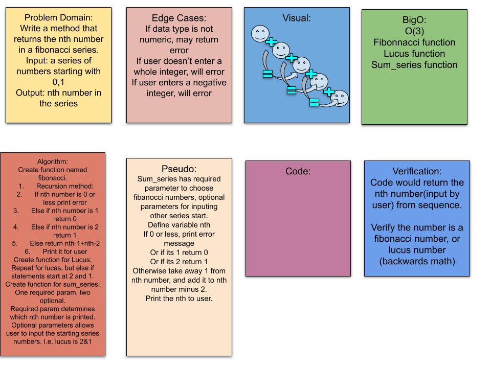

# README

##Fibonacci Series

The Fibonacci Series is a numeric series starting with the integers 0 and In this series, the next integer is determined by summing the previous two.

Challenge
Write a method that returns the nth number in a series

Approach & Efficiency
BigO: Time:O(1) Time is constant, not effected Space:O(n) Linear

Solution
math-series Whiteboard

Worked with [Nebiyu Kifle](https://github.com/neba9)

[geekforgeeks help with tests!](https://www.geeksforgeeks.org/python-program-for-how-to-check-if-a-given-number-is-fibonacci-number/)

[help with tests! from trey hunter](https://treyhunner.com/2016/11/check-whether-all-items-match-a-condition-in-python/)

[Some Fibonacci code to look at](https://medium.com/@dpthegrey/write-a-python-program-to-implement-fibonacci-sequence-for-given-input-dd79be712825)
